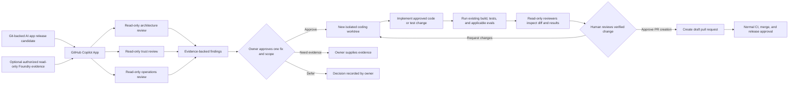

# AI Launch Gate architecture

## Workflow

## Trust boundaries

- Repository code, prompt text, retrieved content, and tool output are untrusted inputs.
- The default evidence boundary is the selected GitHub repository and revision.
- Optional Azure AI Foundry MCP context is read-only and customer-authorized. The demo uses a clearly labeled synthetic JSON fixture instead of a live connection.
- GitHub Copilot App `/orchestrate` coordinates the parallel child sessions. Each session has its own isolated workspace; the human coordinator reviews their reports before synthesis.
- Review sessions are read-only. A separate coding session may edit only a human-approved scope in an isolated Git worktree.
- Human owners retain control of remediation scope, pull request creation, merge, Azure changes, and release approval. The workflow never deploys.

## Three-slide deck outline

1. **Customer problem and outcome:** release findings are handed between engineering, security, and AI operations; show the path from a finding to a tested change.
2. **Workflow and controls:** show parallel read-only reviews, human approval of one scoped fix, an isolated coding worktree, checks, and a second review.
3. **Repeatability and impact:** show the skill, reviewer profiles, sample privacy check, and proposed pilot measures. Label outcomes as targets until measured.